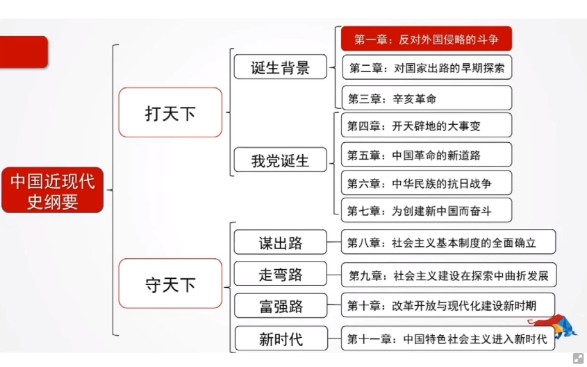
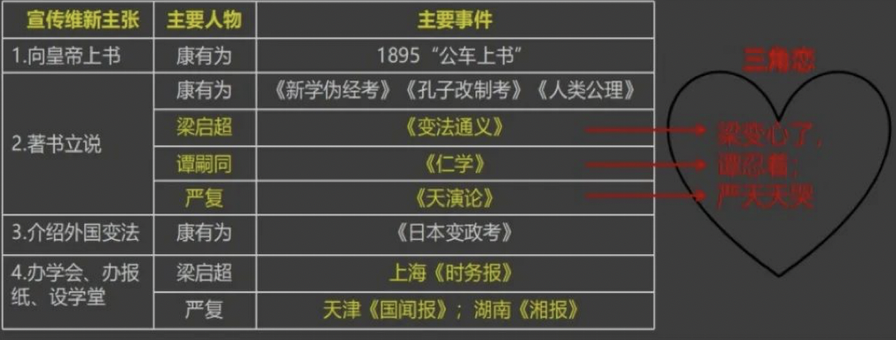
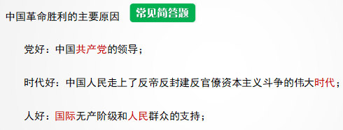
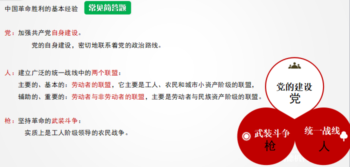
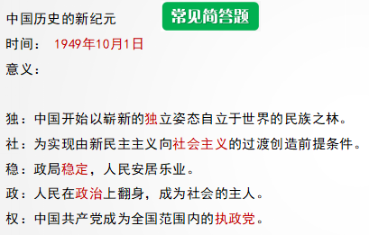
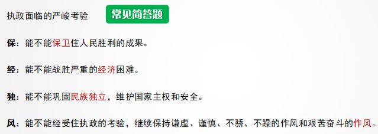
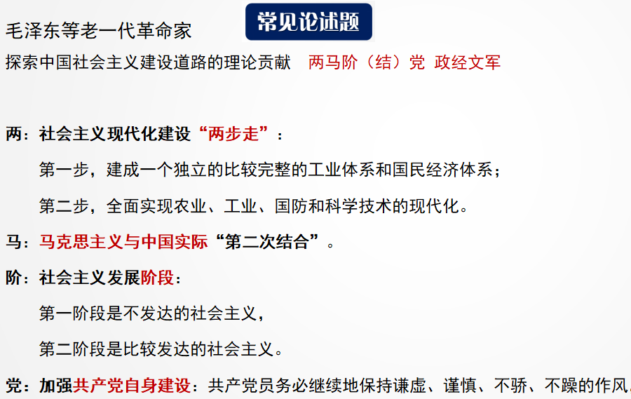
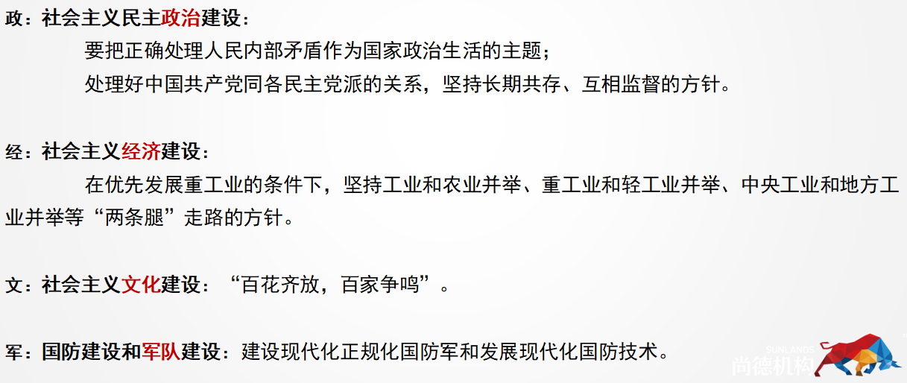

# 中国近现代史纲要

## 课程性质与课程目标

### 课程性质

- 思想政治理论课和历史课

### 课程目标

1. 主题、主线。
   1. 两大历史任务：民族独立和人民解放；国家的繁荣富强和人民的共同富裕。
2. 基本走向和基本规律，两个了解（国史、国情）和四个深刻体会（选马、选共、选社、选改）
3. 历史观、方法论，重大事件和重要人物，科学评价，社会历史条件及深远影响，汲取经验。

### 考核目标

- 识记
- 领会
- 简单应用
- 综合分析：用马，用史论时

### 试卷结构

1. 选择题 50分
2. 简答题 30分
3. 论述题（3选2） 20分

## 概述

## 第一章 反对外国侵略 的斗争

### 第一节 鸦片战争前的中国和世界

#### 01 鸦片战争前的中国**

##### 一、中国封建社会的基本特点【 1810 北京、1904简】

| 特点   | 表现                                          | 主要矛盾         |
|------|---------------------------------------------|--------------|
| 经济   | 封建土地所有制占主导地位(小农经济是中国封建社会的基本生产结构）            | 地主阶级和衣民阶级的矛盾 |
| 政治   | 实行高度中央集权的封建君主专制制度                           | 同上           |
| 文化   | 以儒家思想为核心                                    | 同上           |
| 社会结构 | 形成族权和政权相结合的封建宗法等级制度(核心是宗族家长制，君权、父权、夫权占主导地位） | 同上           |

##### 二、中国封建社会的社会危机

康雍乾盛世：康熙、雍正、乾隆。
乾隆后期，清王朝由盛转衰。主要表现在：

1. 在政治上，中央集权进一步强化，官僚机构膨胩，各级官吏营私舞弊、巧取豪夺，无所不用其
   极。
2. 在经济上，各级宫吏和地主兼并士地，无地少地农民日益增多；地租、赋税、苛捐杂税、徭役
   加重，广大农民生活困苦。
3. 思想文化上，厉行专制、大兴文字狱，整个社会万马齐喑。
4. 军事上，军力衰败、军备废弛，军纪荡然，不堪一击。
5. 对外关系上，实行闭关锁国政策，严格限制对外贸易，使中国处于与世隔绝状态。

#### 02 鸦片战争前的世界

1. 思想上：文艺复兴思想启蒙
2. 政治上：资本主义制度先后确立。
3. 经济上，工业革命迅速发展
4. 对外关系上，把侵略目标瞄向中国

### 第二节 资本-帝国主义对中国的侵略及近代中国社会的演变

#### 03 列强对中国的侵略***【单选1】

##### (一）军事侵略一西方列强对中国侵略，首先和主要的是进行军事侵略。

1. 签订不平等条约
   1. 1840年英国借口林则徐虎门销烟发动第一次鸭片战年（1840-1842），签订不平等条约有：
      1. 中英《江宁条约》（即《南京条约》）《五口通商章程》《虎门条约》
      2. 中美《望厦条约》
      3. 中法《黄埔条约》
   2. 1856年，英法第二次鸦片战争(1856-1860）
   3. 1858清政府分别与英、法、美、俄签订《天津条约》
   4. 1860年清政府分别与英、法两国签订《北京条约》
   5. 1860年清政府与俄国先后签订中俄《瑷珲条约》中俄《业京条约》中俄《堪分西北界约记》等
   6. 1884年中法战争爆发，签订不平等条约有：1885年签订《中法新约》
   7. 1894年日本发动甲午战争，签订不平等条约有：1895年中日签订《马关条约》

2. 侵占领土
   1. 1842年中英《南京条约》：英国割占香港。
   2. 1860年中英《北京条约》：英国割占九龙半岛南端和昂船洲。
   3. 1887年中葡《友好通商条约》：葡萄牙“永驻管理澳门”
   4. 1858年中俄《瑗珲条约》：俄国割占黑龙江以北60多万平方公里领士
   5. 1860年中俄《北京条约》：俄国割占乌苏里江以东40多余万平方公里领土。
   6. 1895年中日《马关条约》：日本割占辽东半岛：台湾全岛及所有附属岛屿；澎湖列岛。

3. 勒索赔款
4. 屠杀人民：①甲午战争：1894年11月，日军制造旅顺大屠杀。②1900年俄国入侵东北：制造江
   东六十四屯惨案。
5. 抢劫财富，破坏中华文明：1860年第二次鸦片战争中英法联军火烧圆明园。

##### (二）政治控制

1. 控制中国内政：《天津条约》允许外国公使常驻北京，直接对清政府发号施令，驻京公使成清政
   府太上皇。
2. 操纵中国外交：军事侵略伴随外交讹诈并行，取得利益之后“一体均沾”。1901年《辛丑条约》
   签订后总理衙门改“外务部”，‘班列六部之前”
3. 享有领事裁判权
   - 1843年中英《五口通商章程》：英国获得领事裁判权。
   - 1844年中美《望厦条约》：美国扩大了领事裁判权。

4. 把持中国海关：中国海关的高级职员全部由外国人充任，英国人赫德自1863年任总税务司，直到
   1908年回国，掌握中国海关大权40余年，
5. 勾结清政府，镇压中国人民反抗斗争《辛丑条约》列强迫使清政府做出永远禁止中国人民成立或加入任何反对他们的组织的承诺，并规定清政府各级官员如对人民反抗斗争“弹压惩办”不力，“即行革职，永不叙用”
6. 扶植和收买代理人
   1. 1861年慈禧在列强支持下发动“北京政变”（又称“辛西政变”或“祺祥政变”），奕䜣掌握总
      理衙门。
   2. 《辛丑条约》签订后列强对中国推行“保全”政策，清政府成了洋人朝廷。

##### (三）经济掠布

1. 控制中国通商口岸1842年《南京条约》：开放广州、厦门、福州、宁波、上海5口为通商口岸。（顺口溜：广福厦上宁波）1860年《北京条约》：开放天津为通商口岸。
2. 剥夺中国关税自主权
3. 对华倾销商品
4. 对华资本输出：最早出现在第二次鸦片战争之后。(1710北京)
5. 操纵中国的经济命脉：
   1. 形成了对中国近代工业的垄断：
   2. 迫使清政府举借外债，以还赔款，并以关税、盐税担保;
   3. 在中国设立银行，使之成为对华输出资本的枢纽。1845年英国丽如银行（东方银行）成为在华开
      办第一家银行：
   4. 控制中国近代的交通运输业：
   5. 给中国的农业经济造成了严重破坏。

##### (四) 文化渗透

1. 宗教渗透和侵略。
2. 为侵略中国制造與论。
   1. 教会在华创办较早外文期刊是：《中国从报》和《北华捷报》（后改名《字林西报》）
   2. 基督教在华设立最大出版机构是：英国人李提摩太创办的广学会，发行《万国公报》。《万国公报》是基督教在中国设主的最大出版机构广学会发行的报刊。
   3. 大肆宣扬“种族优劣论”

##### 条约总结篇

1. “五亿（议)港元”--《南京条约》

   1. “五”指开放广州、厦门、福州、宁波、上海五处通商口岸（顺口溜：“广福厦上宁波”）；
   2. “亿(议了”指英商进出口货物所应缴纳的税款,由中英双方议定；
   3. “港”指将香港岛割给英国：
   4. “元”指清政府向英国赔款2100万元。

2. “公开行贿”--《天津条约》

   1. “公”指外国公使可以进驻北京；
   2. “开”指增开南京、汉口等十处为通商口岸；
   3. “行”指外国商船和军舰可以在长江各口岸自由航行；
   4. “贿〞与钱财有关,指清政府给英法两国巨额赔款。

3. “天天赔酒(九)”--《北京条约》

   - 第一个“天”指清政府承认《天津条约》继续有效：

   - 第二个“天”指增开天津为商埠：

     - “赔”指增加了大量赔款：

     - “酒(九)”指割九龙公司地方一区给英国。

4. “两口(子)分工”---《马关条约》。

   - “两”指赔款给日本白银两化两；
   - “口”指开放沙市、重庆、苏州、杭州为通商口岸(联想记忆法：“天堂牌杀虫剂”）：
   - “分”即分割,指割辽东半岛、台湾、澎湖列岛给日本；
   - “工”指允许日本在通商口岸开办工厂

5. “兵民禁赌！---《辛丑条约》

   - “兵”指允许帝国主义国家派兵驻扎在北京至山海关铁路沿线要地：
   - “民”指把东交民巷辟为“使馆界”
   - “禁”指清政府保证严禁中国人民反帝活动：
   - “赌”与钱有关,指清政府赔款给列强白银4.5亿两。

#### 04 近代中国成为半殖民地半封建社会文六大***

##### (一）近代中国半殖民地半封建社会的特点【简答】

1. 资木一帝国主义不但逐步操纵了中国的财政和经济命脉，而且逐步控制了中国的政治，日益成为支配中国的决定性力量
2. 中国的封建势力同外国侵略势力相勾结，成为外国列强压迫、奴役中国人民的社会基础和统治支柱。
3. 中国自然经济的基础虽然遭到破坏，但是封建剥削制度的根基即封建地主的士地所有制依然在广大地区内保持着，成为中国走向现代化和民主化的严重障碍。
4. 中国资本主义有所发展，并在政治、文化生活中起了一定的作用，但没有成为中国社会经济的主体，在帝国主义和封建主义的压迫下，它的发展很缓慢，力量很软弱，它的大部分与外国资本-帝国主义和本国封建主义都有或多或少的联系
5. 近代中国各地区经济、政治和文化发展极不平衡。
6. 在外国列强和封建主义的双重压道下，中国广大人民尤其是农民日益贫困化，过着饥寒交迫和毫无政治权利的生活。

>  (关键词：帝国主义-封建势力-自然经济-资本主义-不平衡-人民)

#### 05 两对主要矛盾和两大历史任务大女***

##### （一）两对主要矛盾及其关系

【1604简、1610论31、1704简、1710单】近代中国社会的主要矛盾及其相互关系
【答案】

1. 在半殖民地半封建的中国，帝国主义与中华民族的矛盾、封建主义与人民大众的矛盾是两对主要矛盾，而帝国主义与中华民族的矛盾，是各种矛盾中最主要的矛盾。
2. 两对主要矛盾之间的关系：
   - 一是当外国列强向中国发动侵略时，为遊免亡国灭种的危险，中国内部各阶级，除了汉奸、卖国贼外，能够暂时团结起来共同对敌，阶级矛盾降到次要地位，而民族矛盾上升到主要地位。鸦片战争、第二次鸦片战争、中法战争等都是这种情况。
   - 二是当外国侵略者同中国封建政权相勾结，共同镇压中国革命，尤其是封建地主对人民的压迫特别残酷时，中国人民往往用战争的形式反对封建政权，这时阶级矛盾就上升为主要矛盾。如太平天国农民起义和辛亥革命。
   - 三是当国内战争发展到直接威胁帝国主义在华利益以及中国封建地主阶级统治时，外国列强甚至直接出兵，镇压中国人民，援助中国反动派，这时帝国主义和国内封建主义完全公开站在一条战线上。如太平天国农民起义后期中外反动势力的勾结。

##### （二）两大历史任务及其关系

一是求得民族独立和人民解放：二是实现国家繁荣富强和人民共同富裕。两大历史任务既相互区别，又相互联系：

1. 区别在于，二者的主体、内容是不一样的。前者是要从根本上推翻中国半殖民地半封建社会的统治秩序，解决生产关系问题；后者是要改变近代中国经济、文化和社会落后的地位和状况，是要充分发展近代民族工商业，解决生产力问题
2. 联系在于，只有完成第一大任务，才能为第二大任务的完成创造条件。一方面，争取民族独立和人民解放是实现国家繁荣富强和人民共同富裕的前提条件。另一方面，争取民族独立和人民解放的最终目的是使中国走向现代化，实现国家繁荣富强和人民的共同富裕，使中华民族自立于世界民族之林。

### 第三节 抵御外来侵略、争取民族独立的斗争

#### 06 反抗外来侵略的斗争历程大大

##### (一）人民群众的反侵略的斗争【单选2】

鸦片战争--广州三元里抗英斗争：1841年5月，广州郊区三元里人民联络附近103个乡的群众，与英国展开激烈争斗。这是中国近代史上**中国人民第一次大规模的反侵略武裝斗争。**

- 太平军重创外国侵略者：
  1. 1862年5月击毙法国侵华海军司令卜罗德。
  2. 1862年6月活捉“常胜军”副统领法尔思德
  3. 1862年9月击伤“常胜军”统领华尔（不久死去）
  4. 1863年1月打死“常捷军”统领勒伯勒东。

- 台湾人民反侵略斗争：
  1. 1867年击毙美国海军副舰长马肯基。
  2. 1874年痛击日本陆军中将西乡从道率领的侵略军。
  3. 1895年《马关条约》签订后，总兵刘永福率领黑旗军抗击日本侵略者。

- 义和团反抗八国联军斗争：
  1. 1900年，在廊坊和杨村阻击英国海车中将西摩率领的侵略军。
  2. 在天津，攻打老龙头火车站和紫竹林租界。
  3. 在东北抗击沙俄侵略军。

##### (二）爱国官兵的反侵略斗争

- 在第一次鸦片战争中：
  1. 1841年2月广东水师提督关天培在虎门战死。
  2. 1842年6月江南提督陈化成在吴淞战死。
  3. 1842年7月副都统海龄在镇江战死。

- 在第二次鸦片战争中：
  1. 1859.6英法进攻大沽炮台，提督史容椿、乐善（蒙古族）战死。
- 在中法战争中：
  1. 1884年10月督办台湾事务大臣刘铭传率车击退法车在台湾进攻。
  2. 1885年3月冯子材空清军取得镇南关大捷，扭转整个战局。
- 在中日甲午战争中：
  1. 左宝贵战死平壤。
  2. 致远舰管带邓世昌、经远舰管带林永升在黄海战斗中牺牲。
  3. 北洋舰队统帅丁汝昌、定远舰管带刘步蟾在威海卫战斗中牺牲。

#### 07粉碎瓜分中国的图谋大大***

##### 一、边疆危机和瓜分危机【单选3】

- 甲午战争后西方列强瓜分中国高潮：
  1. 俄国：逼迫清政府签订《中俄密约》《旅大租地条约》《续订旅大租地条约》，强租旅顺和大连，将东北变成势力范围。
  2. 德国：1898年3月强租胶州湾，将山东划为势力范围。
  3. 美国：1899年9-11月提出“门户开放”政策

##### 二、义和团运动与列强瓜分中国图谋的破产

- 19世纪末，西方列强瓜分中国图谋未能实现原因：
  1. 重要原因：帝国主义列强之间矛盾和相互制约
  2. 最根本原因：中国人民不屈不挠反侵略斗争。

#### 08 反侵略斗争的失败和民族意识的觉醒大女大

##### (一) 反侵略斗争的失败及其原因(1840-1919）【1810简】

- 最根本原因：社会制度腐败。
- 重要原因：经济技术落后。

##### (二) 民族意识的觉醒【单选4】

1. “师夷长技以制夷”主张和早期维新思想：
   1. 林则徐是近代中国睁眼看世界的第一人：1839年组织翻译了英国人慕瑞的《地理大全》，编成《四洲志》
   2. 魏源开创了中国近代向西方学习的新风：1843年编纂《海国图志》，提出“师夷长技以制夷”恩
   3. 早期维新思想：马建忠、王韬、郑观应、薛福成为代表。
2. 救亡图存与振兴中华：
   1. 1895年严复在《救亡决论》中喊出了“救亡”口号。翻译《天演论》，提出“物竞天择”“适者生存”进化论思想。
   2. 1894年11月孙中山创立第一个资产阶级革命团体--火中会，第一次喊“振兴中华”这个时代

## 第二章 对国家出路的早期探索

### 第一节农民群众斗争风暴的起落

#### 01 太平天国农民战年交女文【单选1

##### (一)金田起义和太平天国政权的建立

1. 太平天国农民战年爆发的原因：
   1. 根本原因：封建专制政权和地主阶级对农民的政治压迫和经济剥削。
   2. 重要原因：外国资本主义的侵略。
      1. 鸦片战争中清政府所消耗的战费、战争赔款转嫁给农民：
      2. 鸦片战争后外国商品输入和鸦片贩卖激增加速中国经济萎缩和人民生活贫困
      3. 客观原因：自然灾害频繁，灾民流离失所
2. 洪秀全创立拜上帝教
   1. 洪秀全(1814-1864），广东花县人。
   2. 1843年建立“拜上帝教”
   3. 作品：《原道救世歌》《原道醒世训》《原道觉世训》。
   4. 1847年洪秀全与冯云山广西紫荆山会合，编订《十款天条》。(政治生活准则、军纪）
3. 太平天国运动过程
   - 太平天国运动
     - 1851金田起义
     - 1852永安建制
     - 1853定都天京
     - 1853-1856北伐西征东征
     - 1856天京事变
     - 1864天京陷落

1. 金田起义
   - 1851年1月，洪秀全率众在广西省桂平县金田村起义，年号太平天国，军队称太平军
2. 永安建制
   1. 1851年3月，洪秀全在东乡宣布称天王。
   2. 1851年9月，攻克永安州。
   3. 1852年洪秀全封王：东王杨秀清，西王萧朝贵，南王冯云山：北王韦昌辉，翼王石达开所封诸王告受东王节制。
   4. 意义：永安建制使太平天国政权初具规模，有利于起义的发展。

3. 定都天京：1853年3月29日，东王迎天王入南京城，改南京为天京，定为都城。

4. 北伐西征东征：击溃江南大营：1856年4月至6月太平至在天京地区击溃了清军江北大营和江南大营，解除了天京威胁，从此进入太平天国军事上的全盛时期。

5. 天京事变

   - 1856年9月，天京事变发生，东王杨秀清、北王韦昌辉被杀，翼王石达开出走后败亡。

   - 后果：天京事变是太平天国由盛到衰转折点，它大大地削弱了太平天国的领导和军事力量，造成了严重危机。

6. 后期斗年：
   1. 提拔英王陈玉成、忠王李秀成主管军事。
   2. 封洪仁玕为干王总理朝政。
7. 天京陷落
   1. 1864年天京被围后李秀成建议“让城别走”，洪秀全却坚守。
   2. 1864年6月洪秀全病逝。
   3. 1864年7月天京陷落，太平天国运动失败。

##### (二)《天朝田亩制度》和《资政新篇》

1. 《天朝田亩制度》
   - 《天朝田亩制度》颁布手1853年冬，是最能体现太平天国社会理想和这次农民战金特点的纲领性文件。（性质、特点〉
   - 主要内容
     1. 本地分配：废除封建士地所有制，确立平均分配士地。
     2. 产品分配：农副产品平均分配，实行圣库制度。
     3. 组织制度：建立以乡官制度为中心的地方基层政权
   - 目的：建立“有田同耕、有饭同食、有衣同穿、有钱同使，无处不均匀，无人不饱暖”的理想社会。
   - 历史评价
     1. 《天朝田亩制度》是一个以解决土地问题为中心的比较完整的社会改革方案，代表了农民要求平均分配土地的强烈愿望，反映了农民反对封建土地所有制的普遍要求，比历代农民起义所提出的口号更深刻一步。（意义：革命性）
     2. 《天朝田亩制度》这个纲领并没有超出农民小生产者的狭隘眼界。它所追求的理想天国，是建立在小农业与家庭手工业相结合的自然经济基础上、没有商品交换和绝对平均的理想社会，是不切实际的空想。（局限性：落后性、空想性）
2. 《资政新篇》：太平天国后期，“王王”洪仁玨提出《资政新篇》，作为统筹全局的建议。
   1. 主要内容（4点)（1710简《资政新篇》中关于政治和经济方面的主要内容）：
      1. 政治方面：
         1. 主张“禁朋党之弊”，加强中央集权，制定法律、制度：
         2. 设”暗柜“，用以监督宫员，改革弊政。
      2. 经济方面：
         1. 发展近代工矿、交通、邮政、金融等事业：
         2. 吸取外国科学技术，奖励科技发明和机器制造：
         3. 提出“准富者请人雇工”，即提倡资本主义的雇佣劳动制
      3. 思想文化方面：
         1. 设新闻官、新闻馆：
         2. 主张革除缠足、溺婴等社会陋习：
         3. 提信兴办学校、医院和社会福利事业。
      4. 外交方面：
         1. 主张同世界各国交往、通商：
         2. 强调允许外国人为天国献策，但不得毁谤国法。
   2. 伟大意义：黄有鲜明的资本主义色彩改革与建设方案。
   3. 致命弱点：通篇未涉及农民和士地问题，缺三实施的阶级基础和社会条件。（局限性）

#### 02 农民斗争的意义和局限***

##### (一)太平天国的历史意义【1704论】

1. 第一，它沉重打击了封建统治阶级，强烈撼动了清政府的统治根基。太平天国起义坚持了14年之久革命势力扩展到18个省，规模大，时间长，影响深，加速了清王朝的衰败过程
2. 第二，它是中国旧式农民战争最高峰。它把干百年来农民对拥有土地的渴望，在《天朝田亩制度》中比较完整地表达出来。《资政新篇》是中国近代史上第
   一个比较系统的发展资本主义的方案，这反映了太平天国某些领导人在后期试图通过向外国学习来寻求出路的一种努力。因此，太平天国起义具有
   不同以往农民战年的新的历史特点。
3. 第三，太平天国起义冲击了孔子和儒家经典的正统权威。这在一定程度上削弱了封建统治的精神支柱。
4. 第四，太平天国农民战争有力地打击了外国侵略势力。太平天国的领袖们拒绝不平等条约，严禁鸦片贸易，与外国军队进行了英勇斗争.
5. 第五，在19世纪中叶的亚洲民族解放运动中，太平天国起义是其中时间最久、规模最大、影响最深的一次。它冲击了西方殖民主义在亚洲的统治。

##### (二）太平天国失败的原因和教训

- 原因：
  1. 根本原因：缺三先进阶级领导
  2. 没有科学理论指导，也不能正确对待儒学。
  3. 把西方人视为“洋兄弟”，对西方列强缺之理性认识。
- 经验教训：在半殖民地半封建社会，农民具有伟大革命力量，但它不能担负起领导反帝反封建斗争取得胜利的重任。

第二节地主阶级统治集团“自救”活动的兴衰

#### 03 洋务运动的兴起大女*【单选2】

##### (一)洋务派的形成（19世纪60-90年代）

1. 时代背景：内忧外患
2. 代表人物--奕诉、曾国藩、李鸿章、左宗棠、张之洞、刘坤一，以“自强”、“求富”为目标，兴办洋务。其中，奕诉是首领。
3. 指导思想----“中学为体，西学为用”。最早作出比较完整论述的是冯桂芬。他说，以中国之伦常名教为原本，辅以诸国富强之术。这个思想后来被进一步概括为“中学为体，西学为用”
4. 1861年，清政府设立总理各国事务衙门，作为综理洋务的中央机关，任命恭亲王奕诉、大学士桂良、户部侍郎文祥为总理衙门大臣。

##### (二)洋务新政的兴办

- 一是兴办近代企业最早兴办的是军用工业：
  1. 1861年曾国藩最早设立安庆内军械所.
  2. 李鸿章筹各的上海江南制造总局是洋务派办的第一个规模较大的可称为近代军事工业的兵工厂。
  3. 李鸿章在南京设立金陵机器局
  4. 左宗棠在福州创办的马尾船政局是当时国内最大造船厂。
  5. 崇厚创办天津机器局。
  6. 张之洞在汉阳创办的湖北枪炮厂是后期最大的军工企业。
  7. 从19世纪70年代开始举办以“求富”为目的的民用企业：
     1. 涉及部门：轮船、电报、采矿冶炼（当时称为轮、电、矿）与纺织工业四个部门。
     2. 主要形式：民用企业有官办、官督商办、官商合办形式，多数采取官督商办方式
     3. 重要企业：轮船招商局、开平矿务局、天津电报局和上海机器织布局是资本主义性质近代企业
- 二是建立新式海陆军。
  1. 陆军陆续使用洋枪炮
  2. 创办新式海军：
     1. 19世纪90年代建成福建水师、广东水师、南洋水师、北洋水师。
     2. 李鸿章管辖的北洋水师是海军主力。
- 三是创办新式学堂，派遺留学生
  1. 创办新式学堂：
     1. 翻译学堂：1862年奕诉奏请创办京师同文馆：1863年李鸿章在上海创办广方言馆。
     2. 工艺学堂：培养电报、铁路、矿务、西医等专门人才。
     3. 车事学堂：福州船政学堂：天津武备学堂。
  2. 派遣留学生：
     1. 1872-1875年派遣四批幼童赴美学习，其中詹天佑成为著名铁路工程师。
     2. 派遣官费留学生进欧洲学习，其中严复成为近代第一位系统介绍西方文化的启蒙思想。

#### 04洋务运动的历史作用及其失败***

1. 洋务运动的历史作用【1804简】
   1. 第一，客观上促进了中国早期工业和民族资本主义的发展。
   2. 第二，成为中国近代教育的开端。
   3. 第三，传播了新知识，打开了人们的眼界，
   4. 第四，引起了社会风气和价值观念的变化
2. 洋务运动失败的原因：（负面评价）【1410简】
   1. 第一，洋务运动具有封建性。
   2. 第二，洋务运动对西方列强具有依赖性。
   3. 第三，洋务企业的管理具有腐朽性。
   4. 第四，顽固派的阻挠。中日甲午战争中，北洋海军全军覆灭，标志着洋务运动失败。

### 第三节维新运动的兴起和天折

#### 05戊成维新运动的兴起***

1. 维新派倡导救亡和变法的活动【单选3】

   1. 维新运动兴起的社会历史条件

      1. 维新运动作为一次具有相当规模的政治运动的兴起，是列强在华划分势力范围、民族危机急剧激化的产物。
      2. 中国民族资本主义的初步发展，是维新运动兴起的物质条件。一批早期维新思想家，要求清政府吸收西方国家进步的政治制度和文化，进行自上而下的社会政治改革，发展资本主义工商业。
      3. 中日甲年战争后.人们普遍对洋务派所标榜的“求富”“自强”的口号发生怀疑,逐渐形成了一种共识,即要救国,只有维新。康有为、梁启超、谭嗣同、严复等成为推动维新思潮的领军人物.并于1898年把这种思潮发展成为一场变法维新的政治运动。

   2. 维新主张：

      

2. 维新派和守旧派的论战

   1. 论战内容：
      1. 要不要变法。
      2. 要不要兴民权、设议院，实行君主立宪。
      3. 要不要废八股、改科举和兴学堂。
   2. 论战意义：
      1. 维新派与守旧派的论战，实质是资产阶级思想与封建思想第一次正面交锋
      2. 论战集中反映了中学和西学、新学和日学之争。
      3. 论战开阔了知识分子眼界，解放了思想，改变了社会风气，为维新变法运动作了思想與论准备。

3. 县花一现的百日维新

   > 1898年6月11日，光绪帝颁布“明定国是”诏书，宣布开始变法。至9月21日的103天里颁布了一系列变法上谕，史称“百日维新”。
   >
   > 戊戌六君子：谭嗣同、林旭、杨说、杨深秀、刘光第与康广仁。

   1. 百日维新的主要内容：
      - 政治方面：
        1. 改革行政机构，裁撒詹事府、通政司、鸿胪寺等闲散重叠机构，撤销湖北、广东、云南三省“督抚同城”巡抚：
        2. 裁汰元员，澄清吏治，提倡廉政；
        3. 准许创办报纸和上书言事。
      - 经济方面：
        1. 设立农工商总局、铁路矿务总局和农会，保护、奖励农工商业、交通采矿业；
        2. 提倡开办实业，奖励发明创造
        3. 设立农会，注重发展农业，提倡西法星殖；
      - 军事方面：
        1. 裁撤绿营，改练新式陆军，采用西洋兵制，；
        2. 筹设武备学堂等
      - 文教方面：
        1. 改革科举制度，废八股，改试策论；
        2. 广设学堂，创办京师大学堂：
        3. 提倡西学，设译书局，选派学生出国留学。

#### 06戊成维新运动的意义及教训大大六

##### （一）戊成维新运动的意义

1. 戊成维新运动是一场爱国救亡运动。
2. 戊成维新运动是一场资产阶级性质的政治改革运动。
3. 戊成维新运动是一场思想启蒙运动。
4. 戊成维新运动在改革社会风气方面有不可低估的意义。

**〔记忆关键词：爱国救亡、政治改革、思想启蒙、社会风气）**

##### （二）戊成维新运动失败的原因和教训

1. 主要原因：维新派自身局限和以慈禧太后为首强大守旧势力反对（敌强我弱）。
   - 维新派自身弱点和局限：【1504简42】【答案】
     1. 第一，不敢否定封建主义。（政治、经济、思想）
     2. 第二，对帝国主义抱有幻想。
     3. 第三，脱离人民群众。
2. 教训：戊成维新是民族资产阶级登上政治舞台第一次表演，显示了民族资产阶级及其知识分子政治朝气，表达了这一新兴阶级的政治追求。戊成维新以失败终，不仅暴露出民族资产阶级软弱性和清朝统治集因腐朽与顽固，同时也说明在半殖民地半封建中国企图通过统治者进行自上而下的改良是行不通的，必须采用革命手段。
   	

## 第三章 辛亥革命

> 主要讲授发生在20世纪初叶的资产阶级革命领导的辛交革命。1911年的辛亥革命，推翻了封建君主专制制度，是一次比较完全意义上的资产阶级革女，应游在险率中军补会半殖民地半封建的性质。胜利果实落在了北洋军阀首领袁世凯手中。

### 第一节 举起近代民族民主革命的旗帜

### 01辛交革命爆发的历史条件**

【单选1】民族危机加深，社会矛盾激化清末“新政”及其破产资产阶级革命派的阶级基础和骨干力量

##### （一）民族危机加深，社会矛盾激化

1. 外国列强扩大对中国侵略，民族危机加深。1904年至1905年，日、俄两国为了争夺在华利益在中国东北进行战争，清政府却宣布“局外中立”
2. 社会矛盾激化，民变四起

##### （二）清末“新政”及其破产

1. 清政府手1901年4月设立督办政务处，实行“新政”
   1. 改革官制，整顿吏治。1901年7月改总理衙门为外务部，“班列六部之前”，新设商部、学部和巡警部等中央部门。
   2. 改革兵制，训练新军。各省筹建武备学堂，裁汰绿营和防勇。
   3. 改革学制，提倡新学。从1906年起废除科举考试。
   4. 奖励工商，兴办实业。颁布《商律》，奖励兴办实业有贡献者。
2. 预备立先骗局：
   - 提出：1906年清政府宣布“预备仿行宪政”，1908年颁布《钦定先法大纲》，制定了预备立宪期为，年的君主立宪方案。

##### (三)资产阶级革命派的阶级基础和骨千力量

1. 阶级基础是民族资产阶级。
2. 骨干力量是资产阶级、小资产阶级知识分子。

### 02资产阶级革命派的活动六大六【单选2】

#### (一) 孙中山与资产阶级民主革命开始

1. 孙中山（1866—1925），广东香山县（今中山市）人。
2. 1894年甲午战争中孙中山上书李鸿章，尝试采取和平手段推进中国变革与进步，但没结果。从此放弃改良，走上资产阶级民主革命之路
3. 1894年孙中山在檀香山组织第一个资产阶级革命组织--兴中会。
4. 1895年春在香港成立兴中会总部，并以“驱除鞑房，恢复中国，创立合众政府”为哲词，决心推翻清政府，建立资产阶级政权。
5. 组织武装斗年

#### (二）资产阶革命派宣传与组织工作

| 宣传组织            | 人物      | 内容                                              |
|-----------------|---------|-------------------------------------------------|
| 1.著书立说，传播民主革命思想 | 章炳麟     | 《驳康有为论革命书》歌颂革命是“启迪民智，除旧布新”的良药，强调中国人有能力建立民主共和制度。 |
|                 | 邬容      | 《革命军》阐述了在中国进行民主革命的正义性和必要性，号召人民推翻清朝统治，建立“中华共和国”  |
|                 | 陈天华     | 《警世钟》和《猛回头》推翻“洋人的朝廷”                            |
| 2.成立革命团体，进行反清斗争 | 黄兴      | 华兴会                                             |
|                 | 蔡元培     | 光复会                                             |
|                 | 吕大森、宋教仁 | 科学补习所                                           |
| 3.中国同盟会         | 孙中山、黄兴  | 1905年8月20日，东京，第一个资产阶级性质政党                       |

第一个全国性资产阶级性质政党----中国同盟会：

1. 成立时间和地点：1905年8月20日在东京成立。
2. 领导：孙中山为总理，黄兴为执行部庶务。
3. 纲领：“驱除鞑虏，恢复中华，创立民国，平均地权”
4. 机关报：《民报》
5. 中国同盟会是第一个全国性资产阶级性质政党，它的成立标志着中国资产阶级民主革命进入一个新阶段。

### 03三民主义学说和关于革命与改良的辦论大大大

#### (一) 三民主义学说【1604论317】

> 1905年11月，孙中山在《民报》发刊词中，将同盟会纲领概括为民族、民权、民生三大主义，后被称为三民主义。
> 民族主义：“驱除鞑虏，恢复中华”
> 民权主义：“创立民国”
> 民生主义：“平均地权”

1. 民族主义：“驱除鞑虏，恢复中华”（前提）
   1. 以革命手段推翻清王朝，改变它一贯推行的民族歧视和压迫政策：
   2. 变“次殖民地”的中国为独立的中国。
   3. 民族主义纲领的提出，加速了清王朝的灭亡，但是没有明确的反帝主张，也没有明确的把汉族军阀、官僚、地主作为革命对象，给了他们破坏革命的可乘之机。
2. 民权主义：“创立民国”（核心）
   1. 推翻君主专制制度，建立资产阶级民主共和国。
   2. 强调民族主义必须和民权主义结合起来。
   3. 为资产阶级革命提出了一套建国方案，但没有明确人民的地位，难以保障人民的真正权利。
3. 民生主义：“平均地权”（补充）
   1. 社会革命。
   2. 基本方案：“核定地价，按价征税，涨价归公，按价收买”的资本主义士地纲领。
   3. 没有正面触及封建士地所有制，不能满足农民士地要求。
4. 三民主义学说的意义：
   - 孙中山的三民主义学说，是一个比较完备的民主主义的革命纲领，产生了积极影响，推动了革命思想的传播和革命运动的发展。

#### (二)关于革命与改良的辩论

1. 论战双方：1905-1907年
   1. 孙中山为代表的革命派以《民报》为阵地。
   2. 康有为为代表的改良派以《新民从报》为阵地。
2. 论战内容：
   1. 要不要以革命手段推翻清政府，这是论战的焦点。
   2. 要不要推翻帝制，实行共和。
   3. 要不要进行社会革命。【1310简41】
      1. 划清了革命与改良界限，使人们认识到实行民主革命的必要性，参加到革命行列。
         1. 使资产阶级民主思想和三民主义思想得到广泛传播，促进了革命力量壮大，为推翻清朝同治的革命斗争奠定了思想基础。
   4. 论战局限：
      1. 革命派未能认清帝国主义本质，不敢提出反帝口号，反市希望争取帝国主义支持。
      2. 革命派只停留在对民主制度形式的理解上，缺乏对民主建政的深入认识。
      3. 革命派未能把土地制度改革和反封建主义联系起来，无法真正解决农民土地问题。

### 第二节辛亥革命的胜利与失败

> 1911年10月10日，武昌起义爆发。武昌起义掀起了辛交革命的高潮，推翻了封建君主专制制度，创建了中华民国，是一次比较完全意义上的资产阶级革命。

#### 04封建君主专制制度的覆灭和中华民国的建立**【单选3】

##### (一)各地武装起义与保路风潮

- 1911年广州起义：1911年4月27日，黄兴领导广州起义。起义失败后，遇难者有72人被葬于广州红花岗（改名为黄花岗），史称黄花岗起义。
- 保路运动：1911年5月，清政府宣布“铁路千线收归国有”，并将粤汉、川汉铁路的路权出卖给帝国主义，引起湖北、湖南、广东、四川反对，四川尤其强烈。署理四川总督赵尔丰制造“成都血案”，引发全川武装暴动。

##### (二)武昌起义和各地响应

1. 革命形势成熟，湖北新车中的共进会和文学社决定在武昌起义。
2. 1911年10月10日晚，新军工程第八营革命党人熊秉坤、金兆龙等打响武昌起义第一枪，成立湖北军政府，推黎元洪为都督。
3. 1912年2月12日，清帝退位，清朝灭亡，在中国延续两千余年的封建帝制覆灭。

##### (三)中华民国临时政府成立

- 1911年底，孙中山在南京被选为临时大总统。
- 1912年1月1日，孙中山在南京宣暂就职，宣告中华民国临时政府成立，改国号为“中华民国”并以1912年为中华民国元年。

###### 南京临时政府是资产阶级共和国性质的革命政权【1710、1510简】

【答案】

1. 第一，从人员构成上看，资产阶级革命派控制着这个政权。除孙中山作为临时大总统拥有统治全国和统率海、陆军之权外，陆军、外交等重要部的总长和所有各部次长全由革命党人担任。同盟会会员在作为国家立法机关的临时参议院中占多数。
2. 第二，从政策措施上看，集中体现了民族资产阶级愿望和利益，并在一定程度上符合广大中国人民利益：
   1. 扫除封建弊端，保护人权：
   2. 鼓励发展资本主义，提倡兴办工厂、矿山、银行、垦殖事业：
   3. 禁止刑讯，保护华侨，禁止贩卖华工和买卖人口，废除奴婢，禁止种植和吸食鸦片；
   4. 改革文化教育制度，否定忠君尊孔，废止小学读经，禁用清政府学部颁行的教科书。

###### 《中华民国临时约法》

1912年3月，临时参议院颁布《中华民国临时约法》，这是中国历史上第一部具有资产阶级共和国宪法性质的法典

1. 主要内容：
   1. “中华民国之主权属于国民全体”，而“以参议院、临时大总统、国务员、法院行使其统治权”。
   2. 设国务总理，作为政府首脑。
   3. 内阁辅佐临时大总统作为行政机关，行使行政权。
   4. 设法院，行使司法权。
   5. 设参议院为立法机关，行使立法权，参议院有弹劾大总统和国务员权利。
   6. 中华民国国民一律平等，享有人身、财产、集会、结社、出版、言论自由，享有请愿、陈述，考试、选举与被选举民主权利。
2. 《中华民国临时约法》意义：
   1. 它以根木大法形式废除了两千年来的封建君主专制制度，确认了资产阶级共和国的政治制度。
   2. 它是革命的产物，带有革命性和民主性。
   3. 它不仅具有现实进步意义，在中国先政史上也具有重要地位。
3. 南京临时政府局限性：
   1. 企图用承认清政府与列强所定的一切不平等条约和一切外债，换取列强承认中华民国。
   2. 没有提出满足农民土地要求的政策和措施，反而以保护私有财产为借口，维护封建士地制度以及官僚、地主所占有的土地和财产。

#### 05 辛亥革命胜利的历史意义以及局限性***

##### (一) 辛亥革命胜利的意义【1510论31】

辛亥革命是比较完全意义上的资产阶级民主革命，是中华民族伟大复兴的一个里程碑，具有伟大的历史意义。

1. 辛交革命推翻了清王朝统治，打击了中外反动势力。
2. 辛交革命结束了两千多年的封建君主专制制度，建立了中国历史上第一个资产阶级共和政府。
3. 辛交革命传播了民主共和观念，推动了中华民族的思想解放。
4. 辛交革命推动了近代中国社会变革，推动了民族资本主义经济的发展，促进了社会风气的改变和人们的精神解放。
5. 辛交革命打击了帝国主义在华势力，推动了亚洲各国民族解放运动的高涨。
   （关键词：推翻了--结束了--传播了--推动了--打击了）

##### (二)辛交革命的局限性（思考：为什么失败？它的失败说明了什么）

- 由于领导者资产阶级革命派自身的软弱性，导致许多局限和错误：
  1. 没有提出彻底的反帝反封建革命纲领。
  2. 没有充分发动和依靠民众。
  3. 没有建立坚强革命政党、
- 辛亥革命教训
  1. 辛交革命只推翻一个清朝政府，而没有推翻帝国主义和封建主义压迫和剥削，没有完成反帝反封建根本任务。
  2. 辛交革命失败表明：资产阶级共和国方案不能救中国，先进中国人需要进行新的探索，为中国谋求新的出路。

#### 06洋军阀的统治和反对北洋军阀的斗争***

##### (一)北洋军阀的统治（1912-1928）

1. 武昌起义爆发后，袁世凯一方面逼清政府任命他为内阁总理大臣，组织责任内阁。另一方面以武力压革命党人，孙中山不得不同意让位。
2. 1912年2月12日，清帝退位，13日袁世凯声明赞成共和，孙中山提出辞呈，
3. 1912年2月15日，临时参议院选袁世凯为临时大总统。孙中山为防止袁世凯专制，提出奠都南京、新总统到南京就职和遵守《临时约法》等条件，但没实现。
4. 1912年3月10日，袁世凯在北京就职
5. 1912年4月1日，孙中山辞去临时大总统职务。
6. 北洋军阀的统治（大地主、买办资产阶级）
   1. 在政治上，实行全阀官僚专制统治
   2. 在经济上，竭力维护帝国主义、地主阶级和买办资产阶级利益。
   3. 在文化思想方面，尊孔复古。
7. 在政治上，实行军阀官僚专制统治：
   1. 以袁世凯为首的封建军阀大力扩充军队，建立特务、警察系统，制定《暂行新刑律》《戒严法》等反动法令；
   2. 袁世凯毁弃孙中山苦心缔造的资产阶级民主制度。如1913年3月，暗杀宋教仁；10月袁世凯强迫议员选自己为正式大总统，下令解散国民觉；1914年5月，炮制《中华民国宪法》用总统制取代内阁制。
   3. 投靠帝国主义：
      - 袁世凯与列强签订“善后大借款”合同，用盐税作抵押，使列强实现了控制和监督中国财政的愿望
      - 1915年5月，袁世凯接受日本提出的损害中国权益的“二十一条”。
      - 皖系军阀段祺瑞向日木借款，其中“西原借款”前后8项达1.45亿元，便利了日本掠夺中国矿产资源和其他原料。
   4. 复辟帝制：
      - 袁世凯复辟（83天）：1915年12月12日，袁世凯发表接受帝位申令。31日，袁世凯下令以1916年为“中华帝国洪宪元年”，准备元旦登基。
      - 张勋复辟（12天）：1917年6月张勋率“辫子军”北上拥戴溥仪复辟，但仅12天就在全国人民声讨中破产

##### (二)反对北洋军阀的斗争【1810简、1904简】（思考：辛交革命失败后，孙中山捍卫革命果实进行了哪些斗争？）

1. 发动“二次革命”（“赣宁之役”）：为反对袁世凯刺杀宋教仁和“善后大借款”，1913年7月李烈钧在江西湖口通电讨袁，不久黄兴在南京宣布讨袁。
2. 组织中华革命党。1914年7月孙中山在东京成立中华革命觉.
3. 发动护国运动。为反对袁世凯称帝，1915年12月25日蔡锷宣布云南独立，护国运动爆发
4. 第一次护法运动。1917年7月孙中山为反对段祺瑞破坏《临时约法》，率领部分国会议员南下广州发动第一次护洪云动。9月1日孙中山业选为中华民国军政府大元帅，西南军阀陆荣廷和唐继尧被选为副元帅。后由于西南军阀排挤，孙中山被迫离學赴沪，第一次护法运动失败。
5. 发动第二次护法运动。1919年10月孙中山将中华革命党改组为中国国民党。1920年11月孙中山重返广东，恢复军政府，领导第二次护法运动。1922年6月陈炯明叛变炮轰孙中山驻地，孙中山登上永丰舰反击失败，8月9日离开广州再赴上海，第二次护法战争失败。

(时间记忆：13、14、15、17、20或3、4、5、7、0）

## 第四章 开天辟地的大事变

## 第五章 中国革命的新道路

## 第六章 中华民族的抗日战争

## 第七章 为创建新中国而奋斗

## 

## 第八章 社会主义基本制度的全面确立

## 第九章 社会主义建设在探索中曲折发展

保持艰苦奋斗的作风

## 第十章 改革开放与现代化建设新时期

## 第十一章 中国特色社会主义进入新时代

